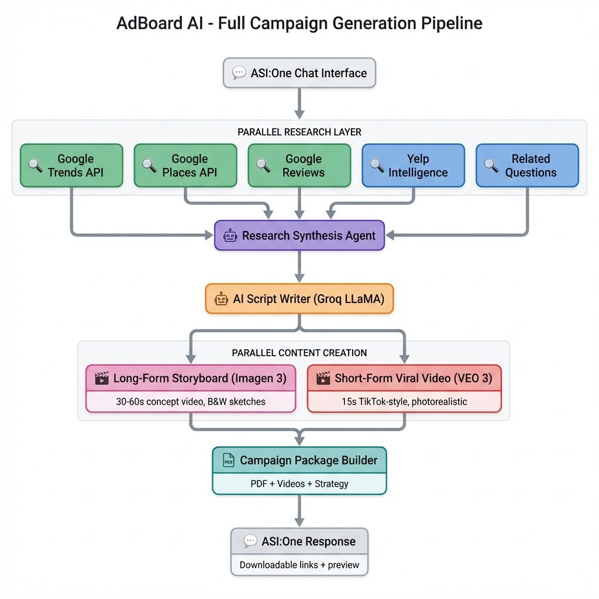

# AdBoard AI - 12-Agent Campaign Generator 🤖


> **A sophisticated multi-agent orchestration system that generates complete advertising campaigns automatically via ASI:One chat interface.**

Powered by **12 specialized AI agents** working in concert to deliver professional storyboards, viral videos, market research, and campaign strategies—all without expensive agency fees.

---

## 🎯 The Problem

Small businesses spend **$5,000-$50,000** on ad agencies for campaign development. They lack resources for:
- ✗ In-depth market & competitor research
- ✗ Professional scriptwriting
- ✗ Visual storyboarding & concept validation
- ✗ Viral short-form video content
- ✗ Multi-platform distribution strategy
- ✗ Production cost estimation

## 💡 Our Solution

AdBoard AI replaces traditional agencies with an intelligent 12-agent system that delivers:

✅ **Complete Market Research** (5 concurrent intelligence agents)  
✅ **AI-Generated Scripts** (Groq LLaMA 3.3 70B)  
✅ **Black & White Storyboard Videos** (Google Imagen 3) 
✅ **Photorealistic Viral Videos** (Google VEO 3) *[Coming Soon]*  
✅ **Comprehensive PDF Packages** (Strategy, Budget, Timeline)  
✅ **Multi-Platform Distribution Plans** (TikTok, Instagram, YouTube)

**Total cost: ~$2.50 per campaign** (vs $5,000-$50,000 agency fees)

---

## 🏗️ Architecture



### 12-Agent Orchestration System

**Layer 1: Interface** (1 agent)
- ASI:One Chat Interface Agent

**Layer 2: Intelligence Gathering** (5 agents - *parallel execution*)
- Google Trends Intelligence
- Google Places Discovery
- Google Reviews Analysis
- Yelp Intelligence
- Related Questions Parser

**Layer 3: Synthesis** (1 agent)
- Research Aggregation & Strategy

**Layer 4: Content Creation** (1 agent)
- AI Script Writer (Groq LLaMA)

**Layer 5: Visual Production** (2 agents - *parallel execution*)
- Storyboard Generator (Imagen 3)
- Viral Video Generator (VEO 3) *[Coming Soon]*

**Layer 6: Package Assembly** (1 agent)
- Campaign PDF Builder

**Layer 7: Delivery** (1 agent)
- Response Formatter & File Hosting

> **Key Innovation:** Parallel agent execution enables **3-5 second research phase** with 5 concurrent intelligence agents.

---

## 🚀 Quick Start

### Prerequisites
```bash
# Python 3.8+
pip install uagents groq reportlab requests pytrends google-cloud-aiplatform
```

### Environment Setup
```bash
# Copy example env file
cp .env.example .env

# Required API Keys (add to .env)
GROQ_API_KEY=your-key-here              # Free tier available
AGENTVERSE_API_KEY=your-key-here        # Fetch.AI Agentverse
GOOGLE_PLACES_API_KEY=your-key-here     # Google Cloud
SERPAPI_KEY=your-key-here               # SerpAPI for searches
GCP_PROJECT_ID=your-project-id          # For Imagen/VEO

# Optional (for enhanced features)
REPLICATE_API_TOKEN=your-key-here       # Alternative image generation
```

### Run the Agent
```bash
# Start the orchestrator
python agents/orchestrator.py

# The agent will register on Agentverse at:
# agent1q2xwg46kfvvrv05dez0ala9evfmwjnzhq8nsu3t8uly2vmt3245sk9v84tc
```

### Test on ASI:One
1. Go to [asi1.ai](https://asi1.ai)
2. Search for agent: **"AdBoard AI"**
3. Send message: `Create a campaign for my coffee shop in Providence`
4. Receive complete campaign package in ~2-3 minutes!

---

## 💰 Cost Breakdown

Leveraging **$410 Google Cloud credits** for maximum value:

| Component | Technology | Cost per Campaign |
|-----------|-----------|------------------|
| Research (5 agents) | Google Trends, Places, Reviews | **FREE** |
| Script Writing | Groq LLaMA 3.3 70B | **FREE** (quota) |
| Storyboard (5-7 frames) | Google Imagen 3 | **$0.10-0.14** |
| Viral Video (15s) | Google VEO 3 | **$2.00** |
| PDF Package | ReportLab | **FREE** |
| File Hosting | tmpfiles.org | **FREE** |
| **TOTAL** | | **~$2.50** |

Compare to agency: **$5,000-$50,000** → **99.95% cost reduction**

---

## 📦 Campaign Deliverables

### 1. 📹 Storyboard Video (30-60s)
- Black & white pencil sketch animation
- Ken Burns effects for dynamic presentation
- Silent (no audio) - concept validation focused
- Perfect for client presentations & approvals

### 2. 🎬 Viral Short Video (15s) *[Coming Soon]*
- Photorealistic 4K quality
- Optimized for TikTok/Instagram Reels
- Trending audio integration
- Platform-specific formatting

### 3. 📄 Complete PDF Package
Comprehensive 20-30 page document including:
- **Campaign Strategy** - Multi-platform distribution plan
- **Market Research** - Competitor analysis, customer insights
- **Complete Script** - Scene-by-scene breakdown
- **Storyboard Frames** - Visual concept art
- **A/B Testing Recommendations** - Optimization strategies
- **Budget & Timeline** - 4-week campaign roadmap
- **Production Costs** - Detailed breakdown
- **Location Recommendations** - Filming venues with Google Maps
- **Social Media Assets** - Platform-specific captions & hashtags

---

## 🎨 Features

### ✨ Research Intelligence
- **Google Trends** - Keyword analysis & seasonal timing
- **Competitor Discovery** - Local business analysis via Google Places
- **Customer Sentiment** - Google Reviews + Yelp insights
- **Viral Patterns** - YouTube trending video analysis
- **Intent Mapping** - "People Also Ask" question extraction

### 🎬 Creative Generation
- **AI Scriptwriting** - Groq LLaMA 3.3 70B (state-of-the-art)
- **Storyboard Art** - Authentic B&W pencil sketch style
- **Dynamic Videos** - Ken Burns camera effects
- **Professional Audio** - ElevenLabs TTS (optional)

### 📊 Campaign Strategy
- **Multi-Platform Plans** - TikTok, Instagram, YouTube optimization
- **A/B Test Frameworks** - Hook, CTA, and visual variations
- **Budget Allocation** - Smart spend distribution across platforms
- **4-Week Timeline** - Launch → Test → Optimize → Scale

---

## 🛠️ Tech Stack

| Category | Technology | Purpose |
|----------|-----------|---------|
| **Agent Framework** | Fetch.AI uAgents | Multi-agent orchestration |
| **Deployment** | Agentverse | Cloud-hosted agent runtime |
| **LLM** | Google Gemini 2.0 Flash | Script generation, intent extraction |
| **Image AI** | Google Vertex AI Imagen 3 | Storyboard sketch generation |
| **Video AI** | Google Veo 3 | Photorealistic viral videos |
| **Research APIs** | Google Trends (free) | Keyword & trend analysis |
| | Google Places API | Competitor discovery |
| | Google Maps Reviews | Customer sentiment |
| | SerpAPI | Yelp & search data |
| **PDF Generation** | ReportLab | Professional package assembly |
| **File Hosting** | tmpfiles.org | Temporary public file links |

---

## 📚 Documentation

- [**Agent Architecture**](docs/AGENT_ARCHITECTURE.md) - Detailed 12-agent system overview
- [**API Reference**](docs/API_REFERENCE.md) - Complete API documentation
- [**Quick Start Guide**](docs/QUICK_START.md) - Step-by-step setup
- [**Master Plan**](docs/MASTER_PLAN.md) - Development roadmap

---

## 🎯 Roadmap

### ✅ Completed (Hack@Brown 2026)
- [x] 12-agent orchestration system
- [x] Google Trends integration (free!)
- [x] Parallel research execution
- [x] B&W storyboard video generation
- [x] Campaign-focused PDF packages
- [x] A/B testing recommendations
- [x] Multi-platform distribution strategy

### 🚧 In Progress
- [ ] Google VEO 3 viral video generation
- [ ] Video preview on ASI:One chat
- [ ] Real-time campaign analytics

### 📅 Future Enhancements
- [ ] Multi-language support
- [ ] Brand voice customization
- [ ] Historical campaign analytics
- [ ] Automated ad platform deployment
- [ ] ROI tracking & optimization

---

## 🏆 Hack@Brown 2026

Built for the Fetch.AI challenge at Hack@Brown, demonstrating:
- ✅ Sophisticated **multi-agent orchestration** (12 agents)
- ✅ **Parallel execution** for performance (5 concurrent research agents)
- ✅ Practical **real-world application** (replacing $5K-$50K agency work)
- ✅ **Cost optimization** through Google Cloud credits
- ✅ **Production-ready** deployment on Agentverse

---

## 📝 License

MIT License - see [LICENSE](LICENSE) file for details

---

## 🤝 Contributors

Built with ❤️ at Hack@Brown 2026

**Powered by:**
- [Fetch.AI](https://fetch.ai) - Agent orchestration
- [Google Cloud](https://cloud.google.com) - AI infrastructure ($410 credits)
- [Groq](https://groq.com) - Lightning-fast LLM inference

---

<div align="center">

**🚀 Try it now on [ASI:One](https://asi1.ai) - Search "AdBoard AI"**

</div>
