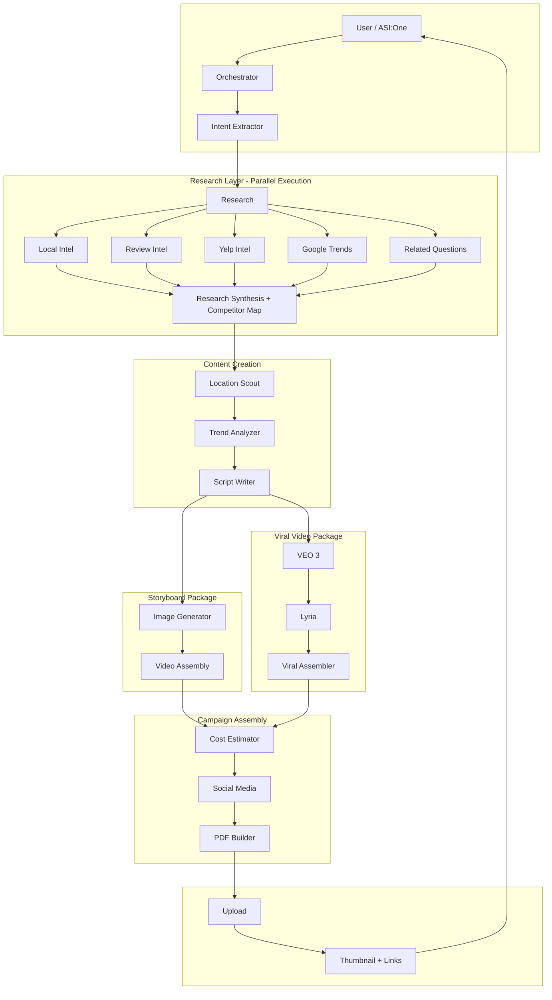

# AdVantage — Agent Orchestration Flowchart

Orchestration flow for the full AdVantage pipeline with **parallel research** and dual output (storyboard + viral).

> **To generate the PNG:** Paste the Mermaid block below into [mermaid.live](https://mermaid.live) and export as PNG. Save as `docs/agent_orchestration.png`.

---

## Full Orchestration Chain (with Parallel Research)

---

## Pipeline Variants

| Pipeline           | Agents                                                                 |
|--------------------|------------------------------------------------------------------------|
| **storyboard_video** (default) | research → location_scout → trend_analyzer → script_writer → image_generator → video_assembly → cost_estimator → social_media → pdf_builder |
| **viral_video**    | research → trend_analyzer → script_writer → veo3_generator → lyria_music → viral_video_assembler |
| script             | research → location_scout → trend_analyzer → script_writer             |
| storyboard         | research → location_scout → trend_analyzer → script_writer → image_generator |
| pdf                | research → trend_analyzer → script_writer → image_generator → cost_estimator → location_scout → pdf_builder |
| quick_test         | script_writer → image_generator → video_assembly → cost_estimator → social_media → pdf_builder |

---

## Files

| File | Purpose |
|------|---------|
| `docs/agent_orchestration.mmd` | Mermaid source (parallel research + dual output) |
| `docs/agent_flowchart.mmd` | Legacy sequential flowchart |

**Generate PNG:** Paste Mermaid into [mermaid.live](https://mermaid.live) → Export → PNG
