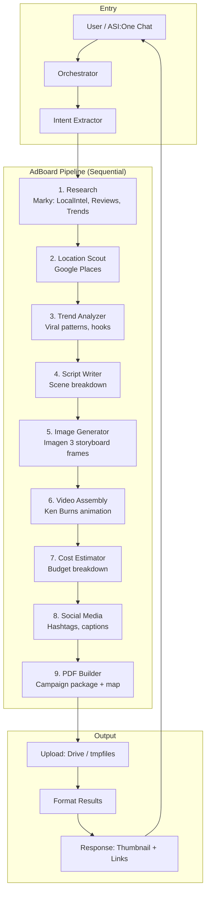
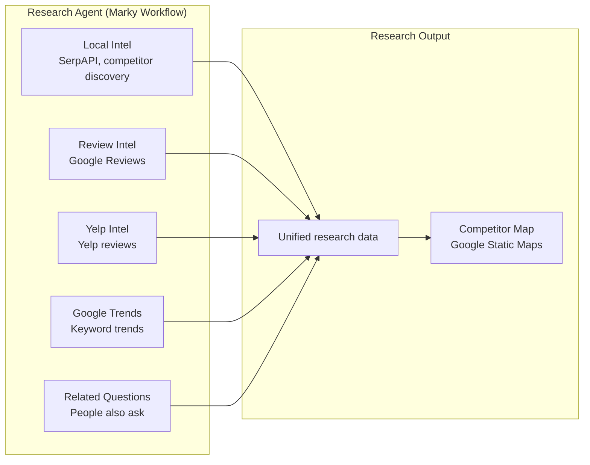

# AdBoard AI — Agent Orchestration Flowchart

Orchestration flow for the **confirmed storyboard_video pipeline**.

> Run `npx -y @mermaid-js/mermaid-cli mmdc -i docs/agent_flowchart.mmd -o docs/agent_flowchart.png` to generate the diagram image.

---

## Main Pipeline (storyboard_video)



---

## Research Sub-Flow (Marky)



---

## Pipeline Variants

| Pipeline           | Agents                                                                 |
|--------------------|------------------------------------------------------------------------|
| **storyboard_video** (default) | research → location_scout → trend_analyzer → script_writer → image_generator → video_assembly → cost_estimator → social_media → pdf_builder |
| script             | research → location_scout → trend_analyzer → script_writer             |
| storyboard         | research → location_scout → trend_analyzer → script_writer → image_generator |
| pdf                | research → trend_analyzer → script_writer → image_generator → cost_estimator → location_scout → pdf_builder |
| quick_test         | script_writer → image_generator → video_assembly → cost_estimator → social_media → pdf_builder |

---

## Rendered Diagram

If you have Node.js, generate the PNG:

```bash
npx -y @mermaid-js/mermaid-cli mmdc -i docs/agent_flowchart.mmd -o docs/agent_flowchart.png
```

Otherwise, paste the Mermaid block from above into [mermaid.live](https://mermaid.live) and export as PNG/SVG.
